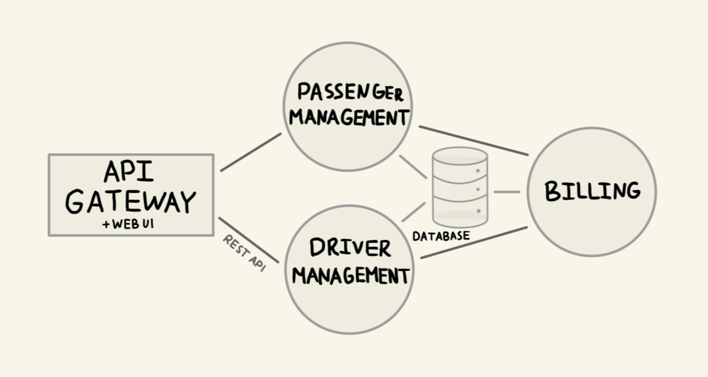

# Taxi ride sharing service 🚖 
My implementation of microservices architecture using Node JS.  

### Architecture diagram

 

Folders structure:
- [`api-gateway`](./api-gateway) - single entry point, starts the server and routes requests to the appropriate microservices
- [`models`](./models) - shared folder for all microservices, allowing them to connect to PostgreSQL database
- [`service-billing`](./service-billing) - Billing
- [`service-driver`](./service-driver) - Driver Management
- [`service-passenger`](./service-passenger) - Passenger Management

 

To start the server run the command  
`docker compose up`
